Place the PCB board inside the bracket. The probes should go through the larger oval.

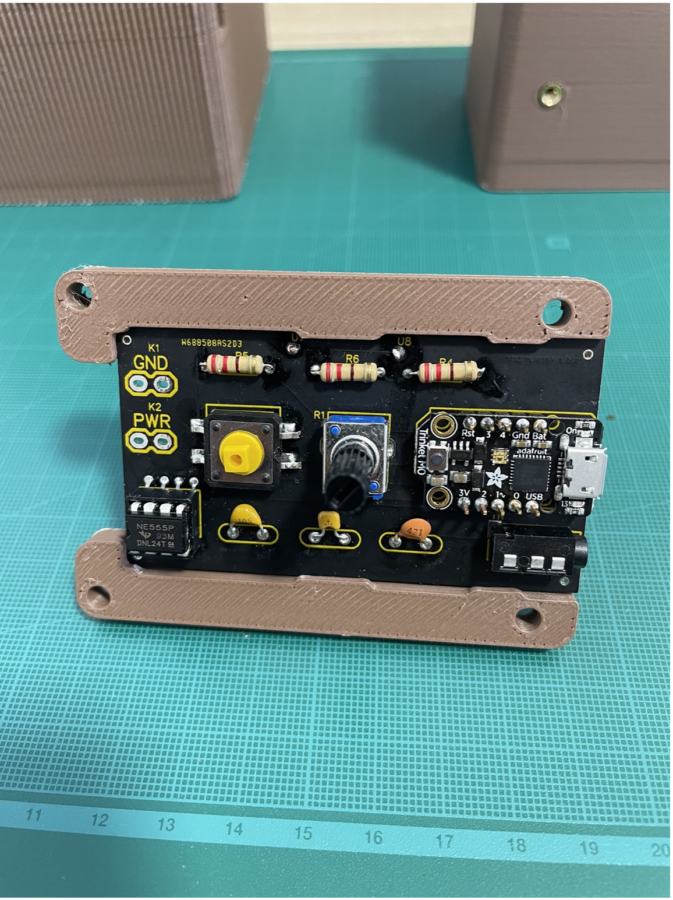{ width="300" }
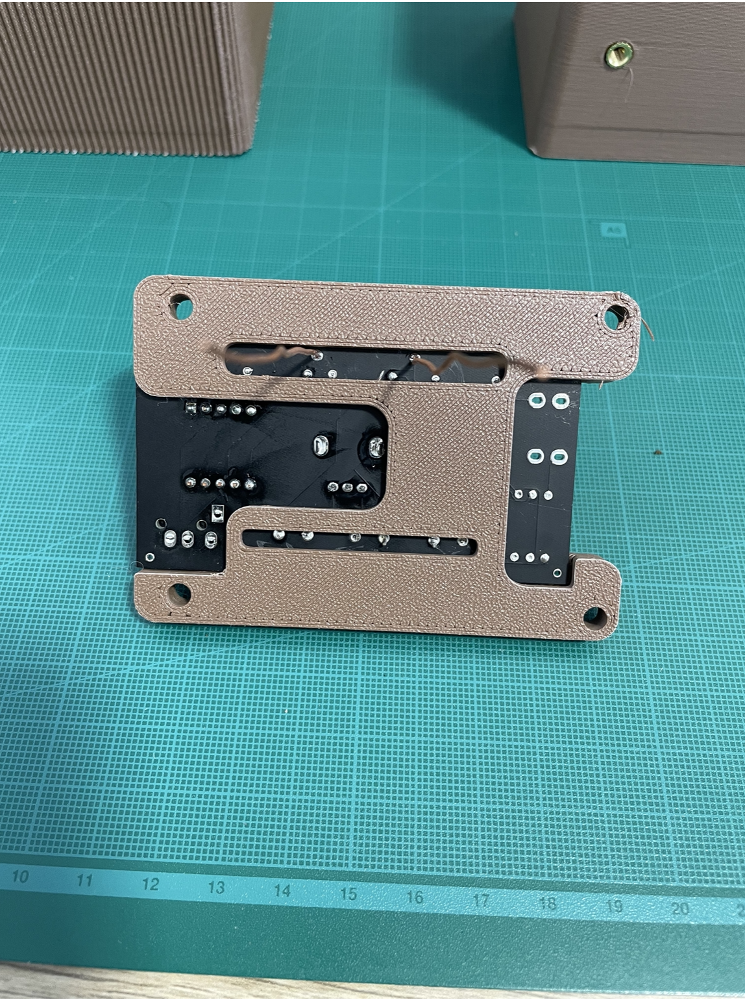{ width="300" }

Place four of the M4 brass inserts in the four holes on the front side of the planter. The smaller diameter side of the brass inserts should go inside the hole first.

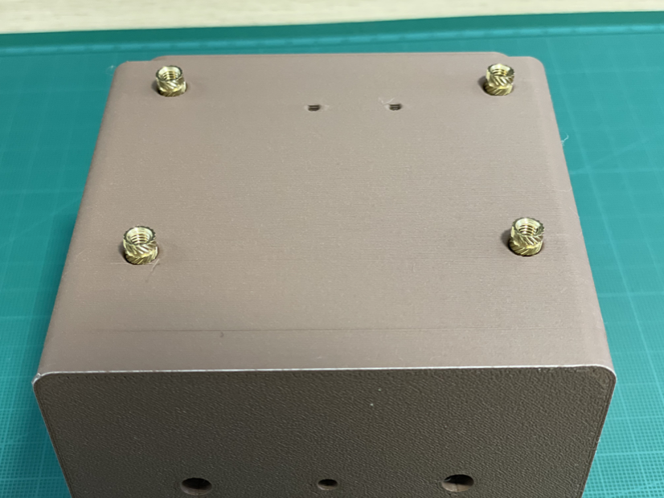{ width="300" }

With a soldering iron, hold the tip of the iron onto one brass insert and gently wait for the insert to slide into place. The heat of the iron contacting the insert will expand the PLA material so the insert will fit snug into the hole. Do this for all four holes.

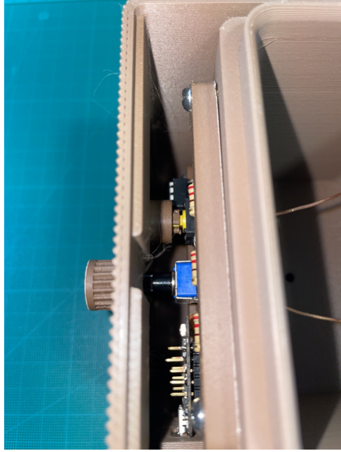{ width="300" }
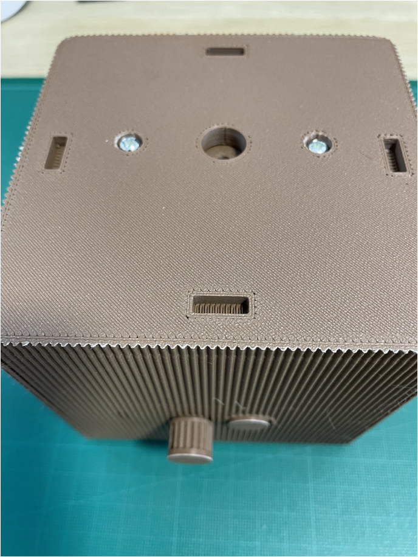{ width="300" }

Use the same technique from step 2 to place the inserts into the two holes at the bottom of the planter.

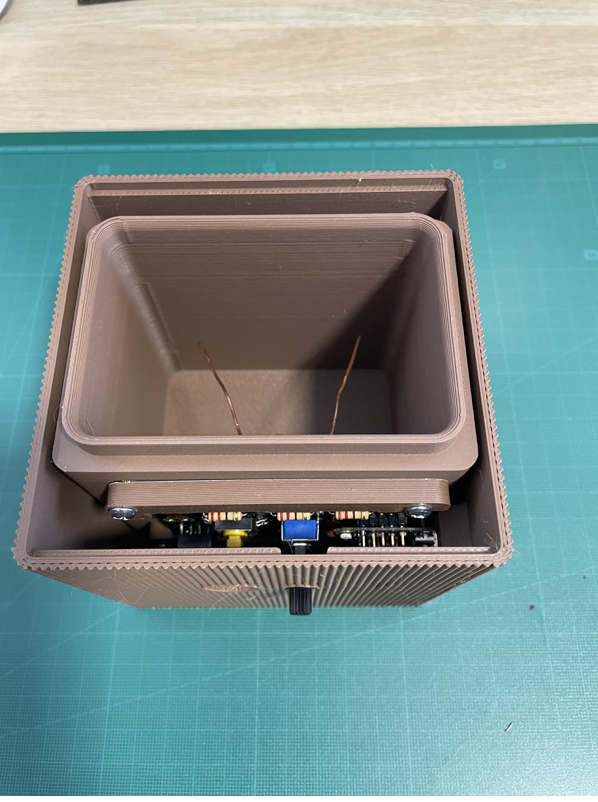{ width="300" }

Line the bracket up with the front of the planter and place four M4 screws through the four holes of the PCB Bracket. The copper wires goes through the two small holes on the front of the planter. Then, screw the four M4 screws to the planter with a screw driver.

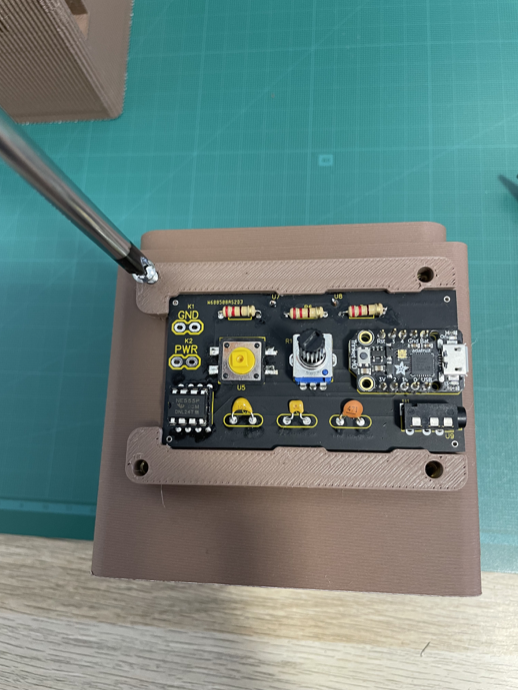{ width="300" }
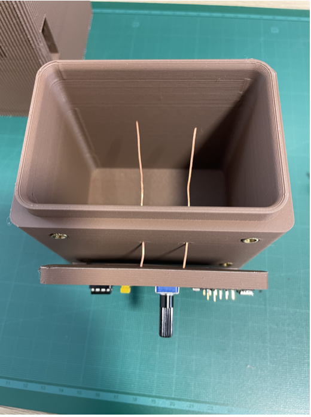{ width="300" }

Place the planter inside of the shell. The back of the planter should slide against the inside back of the shell so the potentiometer can fit. Once the bottom of the planter makes contact with the shell, slide the planter forward to fit into the groove while the potentiometer sticks out of the front hole.

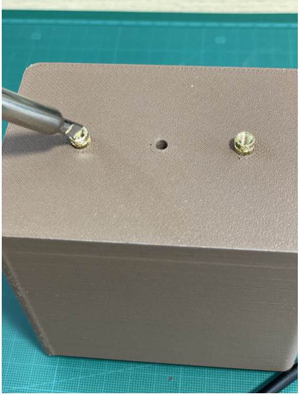{ width="300" }

Using pliers or scissors, remove access PLA that is blocking the two holes at the bottom of the shell.

Place the planter and shell upside down and screw two M4 screws into the two holes with a screw driver.

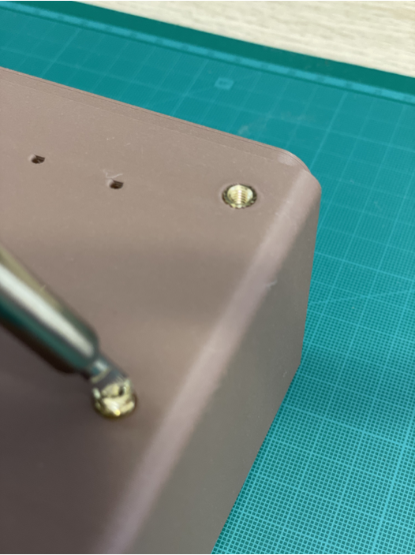{ width="300" }

Slide the knob onto the area of potentiometer sticking out of the shell.
Snap the button onto the tactile switch from the front of the shell. Make sure the square on the button is aligned with the square on the tactile switch.

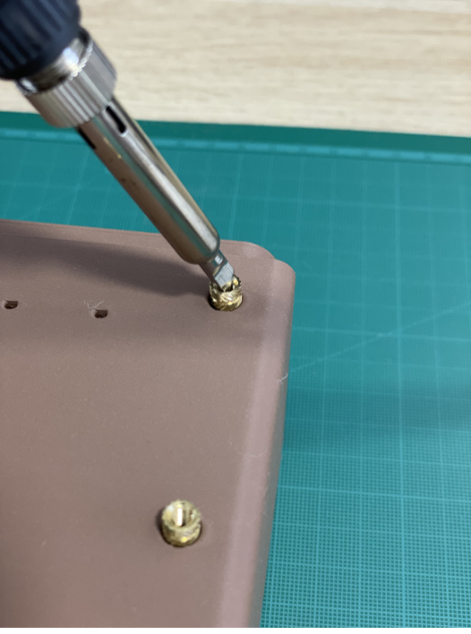{ width="300" }

Place the pool onto the bottom of the shell.

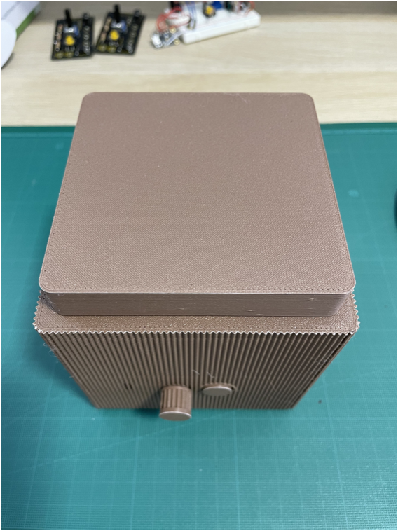{ width="300" }

Flip the planter over and place the hood onto the top.

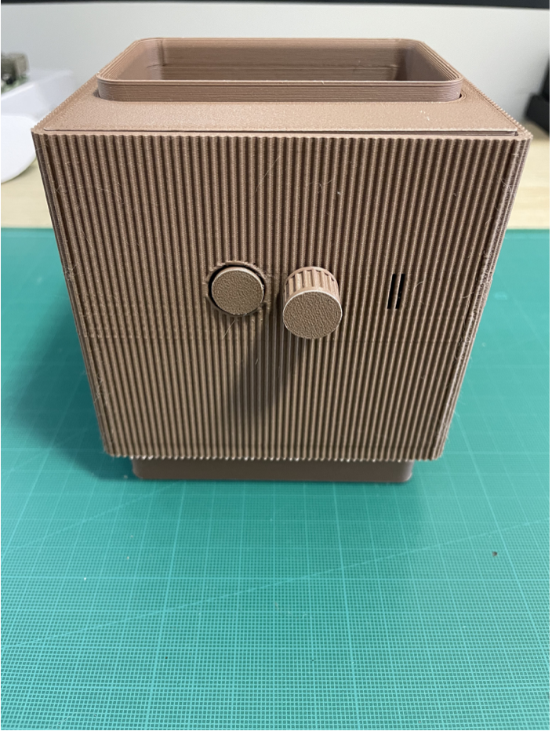{ width="300" }
