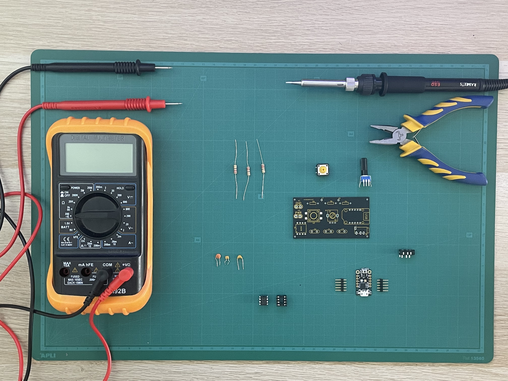

# Parts and Materials

**PCB Parts**

{ width="300" }

Below is a list of components needed to assmeble the pcb. It is recommended to source these components locally from a Maker Space/ Fabrication Lab or a local electronics store. You can find the Gerber file for the PCB [here]().

| Part                       | Online                                                                                    | Quantity |
| -------------------------- | ----------------------------------------------------------------------------------------- | -------- |
| Adafruit Trinket M0        | [Adafruit](https://www.adafruit.com/product/3500)                                         | 1        |
| 555 Timer                  | [AMZN_ES](https://shorturl.at/HQzQk) / [AMZN_US](https://shorturl.at/2IgPi)               | 1        |
| 220 Ohm Resistor           | [Adafruit](https://www.adafruit.com/product/2780)                                         | 3        |
| 1 uF 35V Ceramic Capacitor | [AMZN_ES]() / [AMZN_US](https://shorturl.at/93tgW)                                        | 1        |
| 47 uF Ceramic Capacitor    | [AMZN_ES](https://shorturl.at/sUhQ8) / [AMZN_US]()                                        | 1        |
| 470 pF Ceramic Capacitor   | [AMZN_ES](https://shorturl.at/R7DZH) / [AMZN_US]()                                        | 1        |
| TRS Connector PJ320A       | [AMZN_ES](https://shorturl.at/5Rtxn) / [AMZN_US]()                                        | 1        |
| Tactile Switch             | [Adafruit](https://www.adafruit.com/product/1009)                                         | 1        |
| Potentiometer              | [Diotronic](https://diotronic.com/de-ajuste-con-eje/11321-poten-vertical-10k-pcb-eje-6mm) | 1        |
| 0.9mm Copper Coil          | [AMZN_ES](https://shorturl.at/LzUeT) / [AMZN_US]()                                        | 1        |

**3D Printed Parts & Materials**

{ width="300" }

- Planter
- PCB Bracket
- Hood
- Shell
- Pool
- Button
- Knob

These 3D Design Files can be found [here]()

Below is a list of screws and nuts needed to assemble the 3D parts.

| Part                 | Online                                                                      | Quantity |
| -------------------- | --------------------------------------------------------------------------- | -------- |
| M4 Screws            | [Adafruit](https://www.adafruit.com/product/3500)                           | 6        |
| M4 Brass Nut Inserts | [AMZN_ES](https://shorturl.at/HQzQk) / [AMZN_US](https://shorturl.at/2IgPi) | 6        |

**Tools Needed for Assembly**

- Soldering Iron
- Solder
- 3D Printer
- Multimeter
