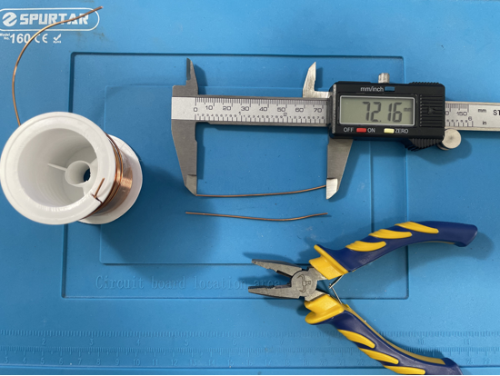
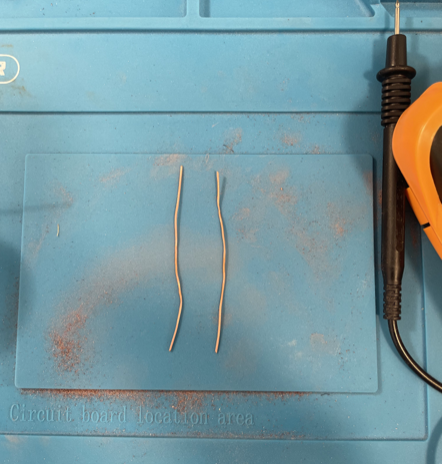
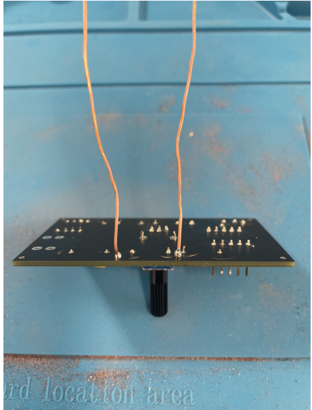

- Cut two pieces of the 0.9mm copper coil at around 72 millimeters.

{ width="500" }

- Sand off the insulating layer of the coils with sanding paper. Wear gloves to protect hands from sand paper.

{ width="500" }

- Set your digital multimeter to continuity mode. To test, touch the multimeter probes to the ends of the copper wire one at a time. If the multimeter beeps or buzzes, it indicates successful end-to-end continuity. If there is no sound, it means the insulating layer on the wire needs to be sanded more thoroughly. Test multiple areas of the probe to make sure the insulating layer is evenly sanded off.

- Solder the two copper coil strips to U7 and U8 on the pcb.

{ width="500" }
