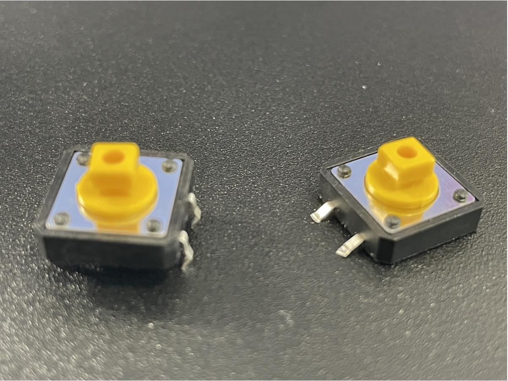
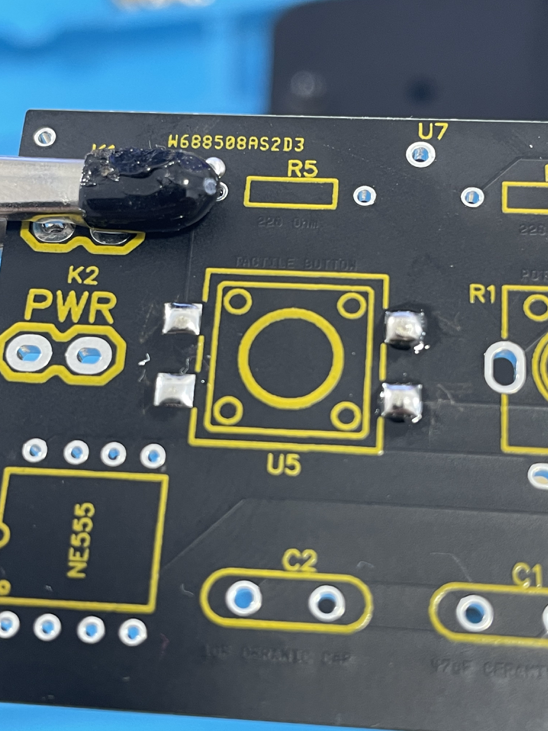
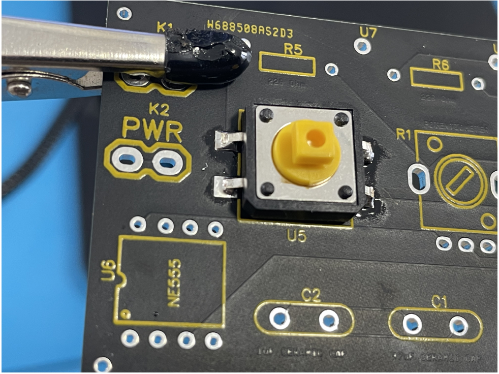

- Bend all the pins on the tactile switch so that they are faced outward instead of down. Using a wire cutter or a scissor, cut the pins so they fit onto the U5 area on the PCB. Below is a picture of what it should look like before(left) and after(right).

{ width="500" }

- With the soldering iron, solder the four onto the four pin areas of U5 then, solder the tactile switch onto U5

{ width="500" }
{ width="500" }
