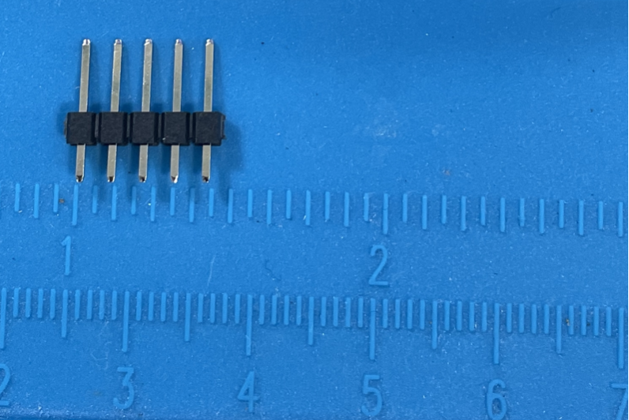
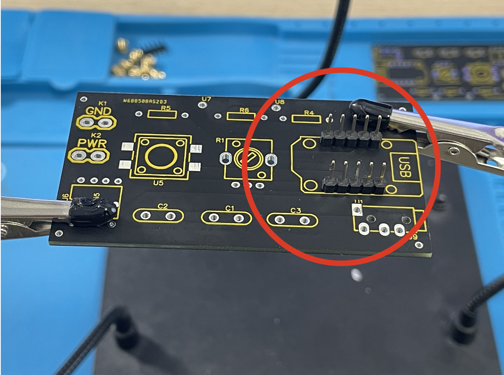
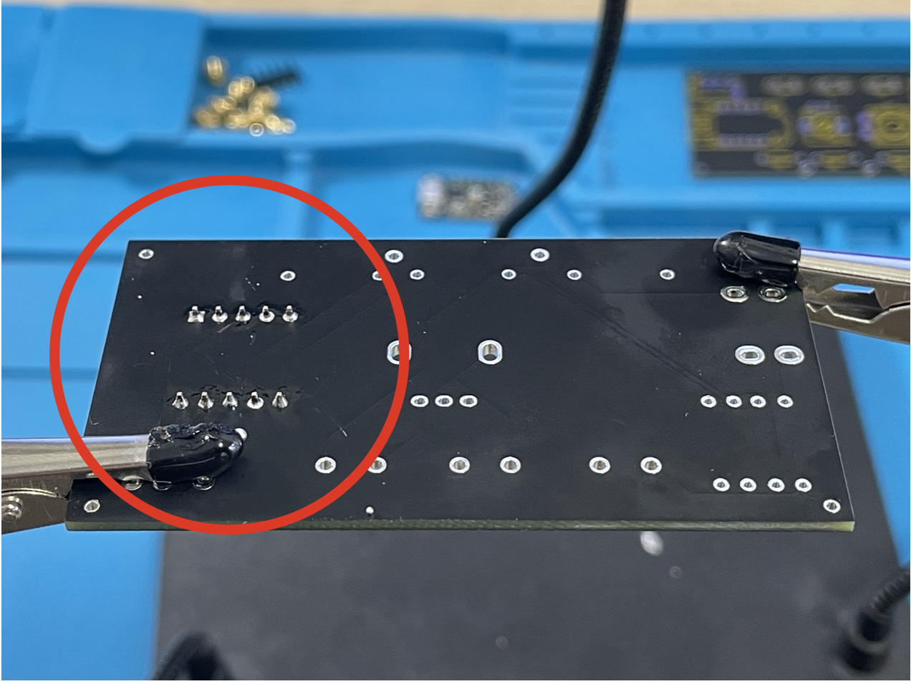
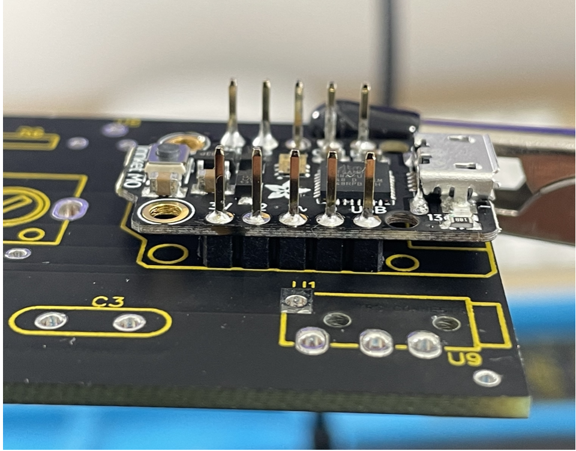
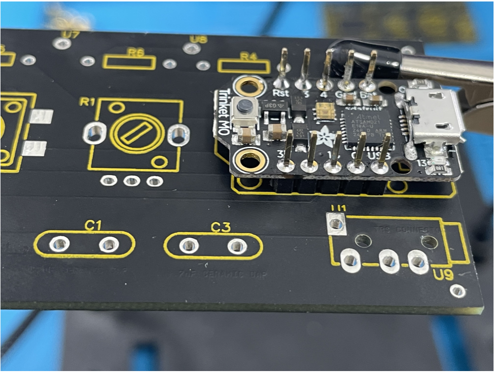

- Snap off 2 sets of 5 header pins that come with the trinket M0. Solder the headers on to the board where the trinket M0 is outlined. The longer sides of the pins should face up.

{ width="500" }
{ width="500" }
{ width="500" }

- Solder the trinket M0 onto the headers.

{ width="500" }
{ width="500" }
